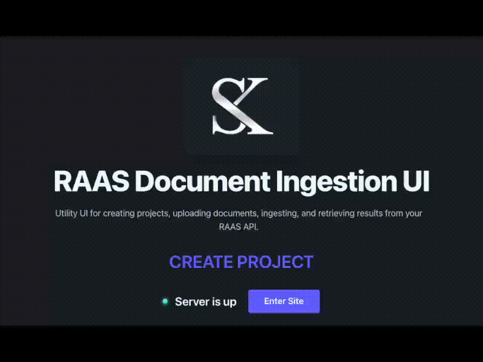

# Retrieval-as-a-Service (RaaS)

<p align="center">
  
</p>

RaaS is a self-hosted retrieval layer for RAG workflows. It gives you a clean base for project-scoped document retrieval: create a project, upload files, ingest into Chroma, and query the most relevant chunks through a UI or API.

## Why This Exists

Most RAG demos stop at "chat with docs" and hide the retrieval layer inside app code. This project pulls retrieval out into its own service so you can:

- manage projects independently
- issue per-project API keys
- upload and ingest documents without custom glue code
- query relevant chunks from your own apps and agents
- customize the ingestion and retrieval pipeline without rebuilding the whole stack

Use it as the retrieval backbone for internal search, document workflows, or a larger RAG system.

## What It Includes

- Next.js frontend for admin login, project management, document upload, and querying
- FastAPI backend for auth, project lifecycle, ingestion, and retrieval endpoints
- Chroma vector storage for indexed document chunks
- per-project API keys for document and query access
- admin password flow for protected project create/delete actions

## How It Works

1. Sign in with the admin password.
2. Create a project and save the generated API key.
3. Upload documents to the project.
4. Trigger ingestion to chunk and index the files in Chroma.
5. Query the project from the UI or call the retrieval API directly.

## Quick Start

Copy the local environment template:

```bash
cp .env.example .env
```

Start backend dependencies:

```bash
docker compose up -d
```

Run the frontend:

```bash
cd raas-frontend
npm install
npm run dev
```

Check the backend health endpoint:

```bash
curl http://localhost:8000/health
```

## Local Docker With `.env`

To run the full app locally from the production `Dockerfile` and load values from your repo `.env`:

```bash
docker build -t raas-local .
docker run --rm \
  --env-file .env \
  -p 8080:8080 \
  -p 8000:8000 \
  raas-local
```

Open:

- `http://localhost:8080`
- `http://localhost:8000/health`

If you change code, rebuild the image before running again:

```bash
docker build -t raas-local .
```

## Retrieval Example

Query the backend directly:

```bash
curl -X POST http://localhost:8000/projects/<PROJECT_ID>/query \
  -H "Authorization: Bearer <PROJECT_API_KEY>" \
  -H "Content-Type: application/json" \
  -d '{"query":"What does this document say?","top_k":5}'
```

Or query through the frontend route:

```bash
curl -X POST http://localhost:8080/api/projects/<PROJECT_ID>/query \
  -H "Authorization: Bearer <PROJECT_API_KEY>" \
  -H "Content-Type: application/json" \
  -d '{"query":"What does this document say?","top_k":5}'
```

## Stack

- Next.js
- FastAPI
- Chroma
- Docker / Docker Compose
- Fly.io for deployment

## Fly.io Deploy

This repo deploys a single Docker image to Fly using [`fly.toml`](fly.toml). The current Fly app is `raas-sk`.

Typical update flow:

```bash
fly auth login
fly status -a raas-sk
fly deploy -a raas-sk
```

That rebuilds the image from the current repo, pushes it to Fly, and rolls the machine to the new container.

Useful follow-up commands:

```bash
fly logs -a raas-sk
fly status -a raas-sk
fly releases -a raas-sk
```

If you need to update config or secrets first:

```bash
fly secrets set KEY=value -a raas-sk
fly deploy -a raas-sk
```

The deployed app serves:

- frontend: `https://raas-sk.fly.dev`
- API: `https://raas-sk.fly.dev/api`

## Developer Notes

For local setup, deployment, and API details, see [DEV_README.md](DEV_README.md).
